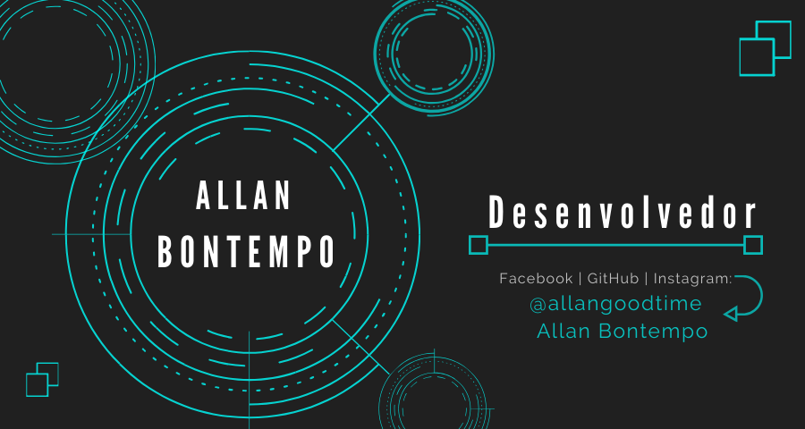

      

# Artistic_Website
I made this web site for the artist Thiago de Paula to publish his projects and sell his products.
It's my first project as a developer.

**Languages used:** HTML, CSS, JavaScript. 
 
**Framework:** Bootstrap.

**Links:**
* [LinkedIn](https://www.linkedin.com/in/allan-bontempo-168721130/);
* [Medium](https://medium.com/);

 

  

