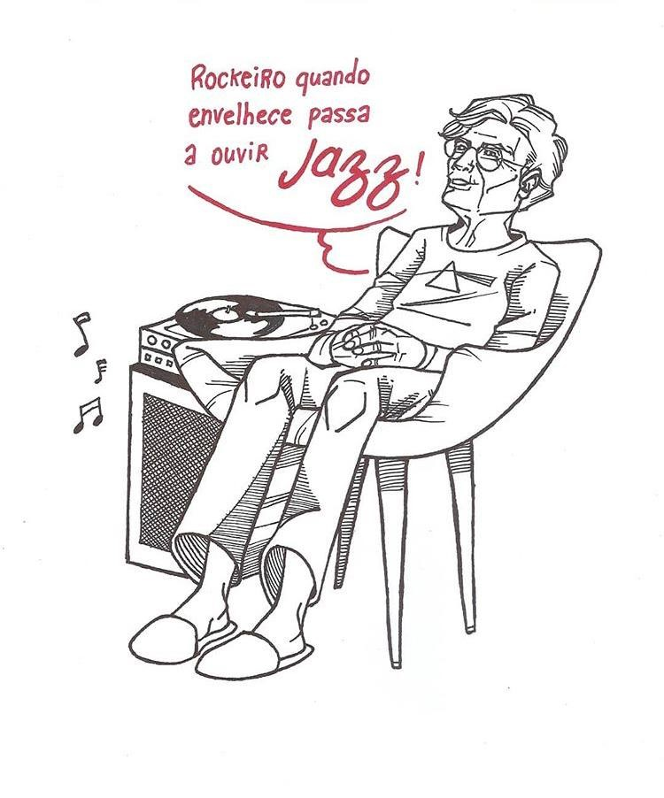

      

# Artistic_Website

 
 

  

 

I made this web site for the artist Thiago de Paula to publish his projects and sell his products.

The main objective of the site is to show the artist's projects, to be his portfolio. 
His books and comics will be read as a virtual book, without the need for downloads, leaving the reader with a comfortable reading experience.

The site also features a responsive contact form, so you can send an email to Thiago without any problems, and in the future there will be a store.

It's my first project as a web developer. I really enjoyed doing this project and I liked the result!! 

**Languages used:** HTML, CSS, JavaScript. 
 
**Framework:** Bootstrap.

**Links:**
* [LinkedIn](https://www.linkedin.com/in/allan-bontempo-168721130/);
* [Medium](https://medium.com/@allanbt);

 

  

